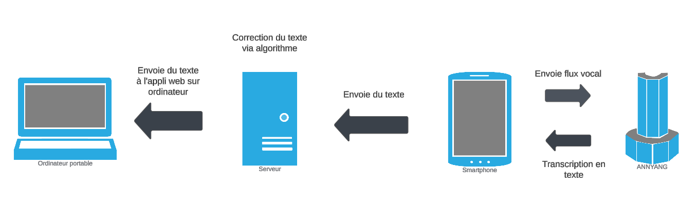

# Projet de Gestion des Prescriptions Médicales

## Setup
Pour configurer le projet, suivez les étapes ci-dessous :
1. Clonez le dépôt : `git clone [URL du dépôt]`
2. Installez les dépendances pour chaque service :
   - Frontend : `cd front-end && npm install`
   - Backend : `cd [nom_du_service] && npm install`
3. Démarrez les services :
   - Frontend : `cd front-end && npm start`
   - Backend : `cd [nom_du_service] && npm start`

## Introduction

Ce projet est une webapp destinée aux médecins pour les aider dans la gestion des prescriptions médicales. Initialement, le projet devait intégrer l'API Vidal, mais nous restons sans nouvelle malgré nos différentes tentatives de contact. 

- L'application offre de nombreuses fonctionnalités avec pour but de faciliter la vie des médecin. Parmis elles, la gestion et l'ajout de patients et la consultation de leur dossier avec toutes leurs informations et l'historique des consultations, la rédaction d'ordonnance, la navigation par commande vocale et la saisie de texte par commande vocale (depuis le PC ou l'application mobile intégrée). 

- L'interface de l'application à été pensées pour être ergonomique et intuitive après avoir indentifier que ces critères étaient un point faible dans les nombreuses applications existantes.

- L'application avait pour but principal d'intégrer l'API Vidal pour pouvoir se baser sur les pathologies des patients, les contraindications ou encore les incompatibilités de traitement pour les prescriptions médicales. Malheureusement, malgrès tous nos effort, aucunes nouvelles de Vidal.

## Architecture
Le projet est basé sur une architecture microservice, permettant une modularité et une scalabilité accrues.


## Stack Utilisée
La stack technologique utilisée pour ce projet est la stack MERN :
- **MongoDB** : Base de données NoSQL.
- **Express** : Framework web pour Node.js.
- **React** : Bibliothèque JavaScript pour construire des interfaces utilisateur.
- **Node.js** : Environnement d'exécution JavaScript côté serveur.

## Sécurité
Pour la sécurité, nous utilisons des tokens JWT (JSON Web Tokens) pour l'authentification et l'autorisation des utilisateurs.

### Schema général


### Génération de JWT
Ce code montre comment générer un token JWT en utilisant l'ID et l'email de l'utilisateur. Le token est signé avec une clé secrète et expire après une heure.
```javascript
const jwt = require('jsonwebtoken');

// Fonction pour générer un token JWT
const generateToken = (user) => {
  // Le token inclut l'ID et l'email de l'utilisateur, et est signé avec une clé secrète
  return jwt.sign({ id: user._id, email: user.email }, process.env.JWT_SECRET, {
    expiresIn: '1h', // Le token expire après 1 heure
  });
};
```

### Vérification de JWT
Ce middleware vérifie le token JWT présent dans l'en-tête Authorization de la requête. Si le token est valide, les informations de l'utilisateur sont ajoutées à la requête.
```javascript
const jwt = require('jsonwebtoken');

// Middleware pour vérifier le token JWT
const verifyToken = (req, res, next) => {
  // Récupère le token de l'en-tête Authorization
  const token = req.header('Authorization').replace('Bearer ', '');
  if (!token) {
    return res.status(401).json({ message: 'Access Denied' });
  }

  try {
    // Vérifie le token avec la clé secrète
    const verified = jwt.verify(token, process.env.JWT_SECRET);
    req.user = verified; // Ajoute les informations de l'utilisateur vérifié à la requête
    next(); // Passe à la prochaine middleware ou route
  } catch (error) {
    res.status(400).json({ message: 'Invalid Token' });
  }
};
```

### Routes sécurisées
Ce code montre comment sécuriser une route en utilisant le middleware `verifyToken`. La route `/patients` est protégée et nécessite un token JWT valide pour accéder aux données des patients.
```javascript
const express = require('express');
const router = express.Router();
const verifyToken = require('../middleware/verifyToken');
const patientController = require('../controllers/patientController');

// Route sécurisée pour récupérer les patients
router.get('/patients', verifyToken, patientController.getAllPatients);

module.exports = router;
```

### AuthProvider
Ce code montre comment créer un contexte d'authentification avec React. Le `AuthProvider` gère l'état de l'utilisateur et fournit des fonctions pour se connecter et se déconnecter.
```javascript
import React, { createContext, useState } from 'react';
import jwtDecode from 'jwt-decode';

// Création du contexte d'authentification
const AuthContext = createContext();

const AuthProvider = ({ children }) => {
  const [user, setUser] = useState(null);

  // Fonction de connexion qui décode le token JWT et met à jour l'utilisateur
  const login = (token) => {
    const decoded = jwtDecode(token);
    setUser(decoded);
    localStorage.setItem('token', token);
  };

  // Fonction de déconnexion qui supprime l'utilisateur et le token du stockage local
  const logout = () => {
    setUser(null);
    localStorage.removeItem('token');
  };

  return (
    <AuthContext.Provider value={{ user, login, logout }}>
      {children}
    </AuthContext.Provider>
  );
};

export { AuthContext, AuthProvider };
```

### AuthContext
Ce hook personnalisé permet d'utiliser le contexte d'authentification dans les composants React. Il fournit un accès facile aux informations de l'utilisateur et aux fonctions de connexion et de déconnexion.
```javascript
import { useContext } from 'react';
import { AuthContext } from '../context/AuthProvider';

// Hook personnalisé pour utiliser le contexte d'authentification
const useAuth = () => {
  return useContext(AuthContext);
};

export default useAuth;
```

### Requêtes API sécurisées
Ces exemples montrent comment effectuer des requêtes API sécurisées en utilisant un token JWT. Le token est ajouté dans l'en-tête Authorization pour authentifier les requêtes.
```javascript
import axios from 'axios';

// Requête pour récupérer les patients avec un token JWT
const fetchPatients = async () => {
  const token = localStorage.getItem('token');
  const response = await axios.get('/api/patients', {
    headers: {
      Authorization: `Bearer ${token}`,
    },
  });
  return response.data;
};

// Requête pour ajouter un nouveau patient avec un token JWT
const addPatient = async (patientData) => {
  const token = localStorage.getItem('token');
  const response = await axios.post('/api/patients', patientData, {
    headers: {
      Authorization: `Bearer ${token}`,
    },
  });
  return response.data;
};
```


## Fonctionnalités Frontend
- **Ajouter des ordonnances** : Les médecins peuvent ajouter de nouvelles ordonnances.
- **Agenda des rendez-vous** : Gestion des rendez-vous des patients.
- **Prévisualisation des ordonnances en PDF** : Les ordonnances peuvent être prévisualisées en format PDF.
- **Saisie vocale** : Les médecins peuvent utiliser la saisie vocale depuis leur PC ou téléphone pour rédiger des ordonnances.
- **Commandes vocales** : Navigation dans l'application via des commandes vocales depuis le PC ou le téléphone.
- **Gestion des patients** : Ajouter et supprimer des patients.

## Fonctionnalités Backen

### Utilisation de MongoDB
Ce code montre comment se connecter à une base de données MongoDB en utilisant Mongoose.
```javascript
const mongoose = require('mongoose');

// Connexion à la base de données MongoDB
mongoose.connect(process.env.MONGODB_URI, {
  useNewUrlParser: true,
  useUnifiedTopology: true,
});

const db = mongoose.connection;
db.on('error', console.error.bind(console, 'connection error:'));
db.once('open', () => {
  console.log('Connected to MongoDB');
});
```

### Avantages de MongoDB
- **Scalabilité** : MongoDB est conçu pour être facilement scalable, ce qui permet de gérer une grande quantité de données et de requêtes.
- **Flexibilité** : La structure de données flexible de MongoDB permet de stocker des documents JSON, ce qui est idéal pour les applications web modernes.
- **Performance** : MongoDB offre des performances élevées pour les opérations de lecture et d'écriture, ce qui est crucial pour une application de gestion des prescriptions médicales.

### Commandes et Saisie Vocale
Nous utilisons Anyang pour les fonctionnalités de reconnaissance vocale, permettant aux médecins d'utiliser des commandes vocales depuis leur PC ou téléphone.




#### Exemple de code pour la configuration d'Anyang :
```javascript
if (annyang) {
  // Définition des commandes vocales et des actions associées
  const commands = {
    'show prescriptions': () => {
      // Code pour afficher les prescriptions
    },
    'add patient': () => {
      // Code pour ajouter un patient
    },
  };

  // Ajoute les commandes à Anyang
  annyang.addCommands(commands);
  // Démarre la reconnaissance vocale
  annyang.start();
}
```

### Application Mobile en React Native
L'application mobile communique avec le backend via des endpoints API sécurisés.

#### Endpoints API pour l'application mobile :
```javascript
// Endpoint pour récupérer les données des patients
app.get('/api/patients', verifyToken, (req, res) => {
  // Code pour récupérer les patients depuis la base de données
});

// Endpoint pour ajouter un nouveau patient
app.post('/api/patients', verifyToken, (req, res) => {
  // Code pour ajouter un nouveau patient à la base de données
});
```

## Difficultés Rencontrées
- **API Vidal** : Pas de nouvelles de Vidal pour l'intégration de leur API.
- **Microsoft Azure** : Difficultés rencontrées avec Microsoft Azure, ce qui nous a conduit à utiliser Anyang pour les fonctionnalités de reconnaissance vocale.
- **Sécurité** : Découverte et implémentation des JWT pour la sécurité.

## Perspectives Futures
- **Intégration de Vidal** : Nous espérons enfin intégrer l'API Vidal.
- **Application mobile** : Développement d'une application mobile pour une accessibilité accrue.
- **Intégration d'une IA** : Intégration d'une intelligence artificielle pour améliorer les fonctionnalités de l'application.
